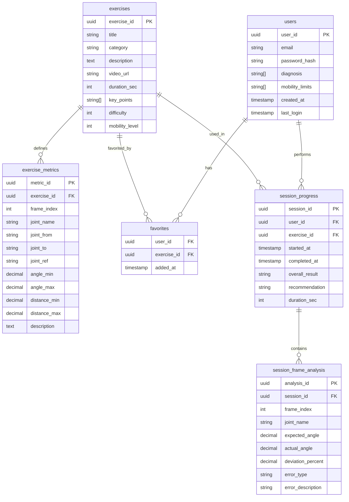

**Техническое задание на разработку мобильного приложения «Move Well»**

**1. Цель и область применения**

Приложение предназначено для проведения дистанционной реабилитации людей
с ограниченными возможностями (ОВЗ) и маломобильных граждан.
Пользователь выполняет физические упражнения, повторяя за
демонстрируемым видео, а приложение с помощью камеры анализирует
движения и выдает обратную связь: правильно ли выполнено движение, какие
допущены ошибки.

**2. Целевая аудитория**

-   Люди с легкими и средними нарушениями опорно-двигательного аппарата

-   Пожилые люди с ограниченной подвижностью

-   Врачи-реабилитологи и ЛФК-инструкторы (как наблюдатели)

**3. Основные требования к функциональности**

3.1. Модуль видеоупражнений

\- Категории упражнений (руки, ноги, корпус)

\- Для каждого упражнения:

\- демонстрационное видео

\- текстовое описание

\- список ожидаемых движений/ключевых точек (углы, амплитуда, симметрия)

\- Возможность фильтрации и поиска упражнений

3.2. Выполнение упражнения на камеру

\- Запись видео пользователя через фронтальную камеру (синхронно с
эталонным видео, разбить видео по шагам)

\- Автоматическое распознавание позы человека (скелетная модель,
библиотека OpenPose)

\- Сравнение позы пользователя с эталоном

3.3. Обратная связь после выполнения

\- Общая оценка: «Хорошая работа» / «Есть ошибки»

\- Детальная обратная связь в виде:

\- текстовых замечаний («левая рука ниже эталона», «неполное разгибание
колена»)

\- Рекомендация: повторить упражнение либо закончить

3.4. Личный кабинет и прогресс

\- Профиль пользователя

-   Избранные видео

3.5. Роль врача

\- Возможность корректировать программу упражнений удаленно на личной
консультации

**4. Требования к обработке данных и ИИ-модулю**

  --------------- --------------------------------------------------------
  **Компонент**   **Требование**

  Распознавание   Работа в реальном времени
  позы            

  Сравнение с     Сравнение относительных углов и расстояний между
  эталоном        ключевыми точками

  Аугментация     Возможность адаптировать эталонное движение под
  эталонов        пользователя после калибровки
  --------------- --------------------------------------------------------

**5. Технические требования**

5.1. Платформа

\- iOS (12+) и Android (9+)

\- Кроссплатформенная разработка (React Native) с нативными модулями для
камеры и ML

5.2. Производительность

\- Задержка между движением и обратной связью ≤ 1 секунда после
завершения упражнения

5.3. Безопасность и приватность

\- Обработка видео локально, на устройстве.

\- Соответствие 152-ФЗ

**6. Схема БД**

**7. Общая архитектура**

[Общая архитектура](./общая_архитектура.JPG)

**8. Описание методов API**

[API документация](./Описание_методов_api.md)